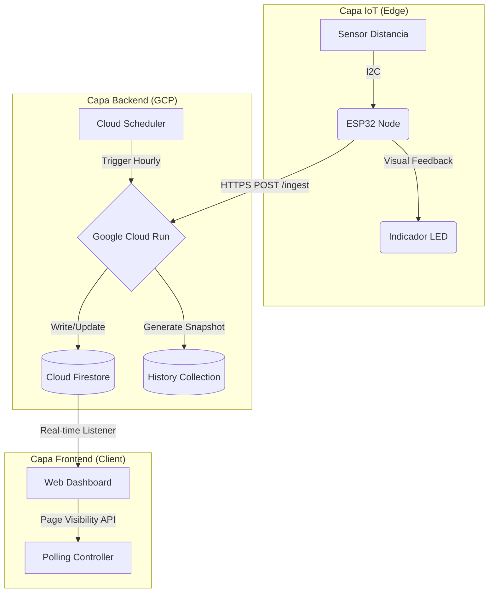

# System Architecture

S-Parking implements a **cloud-native, event-driven architecture** with three distinct layers that ensure high availability, real-time performance, and operational efficiency.

## Architecture Overview

The system is designed around three core principles:

1. **Edge Intelligence**: Sensors make local decisions and handle network failures autonomously
2. **Serverless Backend**: Zero-maintenance microservices that scale automatically
3. **Real-time Frontend**: Instant UI updates with intelligent caching and cost optimization



## Layer 1: Edge (IoT Devices)

### Hardware Components

Each parking spot is equipped with:

- **ESP32 Microcontroller**: WiFi-enabled MCU running at 240MHz
- **Adafruit VL53L0X Sensor**: Time-of-Flight laser rangefinder (up to 2 meters)
- **RGB LED Indicator**: Visual feedback for drivers (common anode)

### Firmware Architecture

The ESP32 firmware (`S-Parking.ino`) implements a **dual-loop state machine**:

#### Fast Sensor Loop (500ms)

```cpp
if (currentMillis - lastSensorRead >= sensorInterval) {
    lastSensorRead = currentMillis;
    readLocalSensor();
    updateLEDs();
}
```

Reads the VL53L0X sensor every 500ms to ensure sub-second response time when a vehicle arrives or departs.

**Detection Logic:**
```cpp
if (measure.RangeStatus != 4 && measure.RangeMilliMeter < 400) {
    nuevoEstadoSensor = 0; // Occupied
} else {
    nuevoEstadoSensor = 1; // Available
}
```

- **Threshold**: 400mm (40cm)
- **RangeStatus 4**: Out of range or error
- **Immediate Cloud Update**: Only sends HTTP POST when state changes

#### Cloud Polling Loop (15s)

```cpp
if (currentMillis - lastCloudPoll >= cloudPollInterval) {
    lastCloudPoll = currentMillis;
    checkCloudStatus();
}
```

Every 15 seconds, the sensor polls the cloud to verify synchronization and detect reserved spots.

### Self-Healing Mechanism

The firmware implements **bidirectional truth reconciliation**:

```cpp
// CASE A: Local says Available (1), Cloud says Occupied (0)
if (estadoLocalSensor == 1 && estadoNube == 0) {
    Serial.println("¡Desincronización detectada! Forzando actualización a DISPONIBLE...");
    sendStateToCloud(1);
}

// CASE B: Local says Occupied (0), Cloud says Available/Reserved (1 or 2)
if (estadoLocalSensor == 0 && (estadoNube == 1 || estadoNube == 2)) {
    Serial.println("¡Desincronización detectada! Forzando actualización a OCUPADO...");
    sendStateToCloud(0);
}
```

**Why This Matters:**
- Network packets can be lost (WiFi interference, router issues)
- Cloud updates might fail during deployments
- Physical reality (sensor reading) is always the source of truth

### LED State Priority Logic

```cpp
void updateLEDs() {
    // Priority 1: Physical vehicle present = RED
    if (estadoLocalSensor == 0) {
        setColor(1, 0, 0); // Red
        return;
    }

    // Priority 2: Reservation active = AMBER
    if (estadoNube == 2) {
        setColor(1, 1, 0); // Red + Green = Amber
        return;
    }

    // Priority 3: Available = GREEN
    setColor(0, 1, 0); // Green
}
```

<Note>
  The LED color always reflects the **highest priority state**: Physical > Reservation > Available. This prevents reserved spots from showing green when empty.
</Note>

## Layer 2: Backend (Google Cloud Platform)

### Serverless Architecture

All backend services run as **stateless containers** with automatic scaling:

- **Runtime**: Node.js 20 LTS
- **Container Registry**: GCR (Google Container Registry)
- **Orchestration**: Cloud Run (fully managed)
- **Concurrency**: Up to 80 requests per container

### Microservices Breakdown

#### 1. Ingest Service (Cloud Run)

**Purpose**: Receives sensor data via HTTPS POST

**Location**: `gcp-functions/services_ingest-parking-data_*/index.js`

**Key Logic**:

```javascript
const sensorStatus = req.body.status; // 0 (Occupied) or 1 (Available)
const currentStatus = currentData.status; // Current state in DB

// CASE 1: Protect active reservations
if (currentStatus === 2 && sensorStatus === 1) {
    console.log(`Protegiendo reserva del puesto ${spotId}. Sensor dice 1, pero mantenemos 2.`);
    return res.status(200).send('Puesto reservado, esperando llegada del auto.');
}

// CASE 2: Reservation fulfilled - vehicle arrived
if (currentStatus === 2 && sensorStatus === 0) {
    await docRef.update({
        status: 0,
        last_changed: FieldValue.serverTimestamp(),
        reservation_data: FieldValue.delete()
    });
    return res.status(200).send('Reserva completada. Puesto ahora ocupado.');
}
```

**Reservation Protection**: The backend ignores "Available" readings from sensors when a reservation is active. This prevents the system from canceling a reservation just because the reserved driver hasn't arrived yet.

#### 2. Get Status Function (Cloud Function)

**Purpose**: Returns all parking spots with automatic reservation expiration

**Location**: `gcp-functions/get-parking-status_function-source/index.js`

**Expiration Logic**:

```javascript
const now = new Date();
const expiresAt = data.reservation_data.expires_at.toDate();

if (now > expiresAt) {
    console.log(`Reserva vencida en ${spotId}. Liberando puesto...`);
    
    batch.update(docRef, {
        status: 1, // Back to Available
        last_changed: FieldValue.serverTimestamp(),
        reservation_data: FieldValue.delete()
    });
    
    status = 1; // Return corrected status immediately
}
```

**Smart Cleanup**: This function checks expiration on every read request, eliminating the need for a separate cleanup cron job.

#### 3. Reserve Spot Function (Cloud Function)

**Purpose**: Creates time-limited reservations with transaction safety

**Location**: `gcp-functions/reserve-parking-spot_function-source/index.js`

**Transaction Logic**:

```javascript
await firestore.runTransaction(async (t) => {
    const doc = await t.get(docRef);
    const data = doc.data();
    
    if (data.status === 0) {
        throw new Error("El puesto está ocupado por un vehículo.");
    }
    if (data.status === 2) {
        throw new Error("El puesto ya tiene una reserva activa.");
    }

    const expirationTime = new Date();
    expirationTime.setMinutes(expirationTime.getMinutes() + parseInt(duration_minutes));

    t.update(docRef, {
        status: 2,
        last_changed: FieldValue.serverTimestamp(),
        reservation_data: {
            license_plate: license_plate,
            expires_at: expirationTime,
            duration: parseInt(duration_minutes)
        }
    });
});
```

**Why Transactions**: Prevents race conditions where two users try to reserve the same spot simultaneously.

#### 4. Manage Zones Function (Cloud Function)

**Purpose**: CRUD operations for parking zones

**Location**: `gcp-functions/manage-zones_function-source/index.js`

```javascript
if (action === 'create') {
    const zoneId = id || `zone_${Date.now()}`;
    
    await firestore.collection('parking_zones').doc(zoneId).set({
        id: zoneId,
        name: name.trim(),
        order: newOrder,
        desc: desc || '',
        color: color || 'blue',
        created_at: new Date(),
        updated_at: new Date()
    });
}
```

Supports `create`, `update`, and `delete` actions via the `action` parameter.

### Data Model (Firestore Collections)

#### `parking_spots` Collection

```javascript
{
    "id": "A-01",                    // Document ID (same as spot_id)
    "status": 1,                      // 0=Occupied, 1=Available, 2=Reserved
    "last_changed": Timestamp,        // Server timestamp
    "lat": -33.4569,                  // GPS latitude
    "lng": -70.6483,                  // GPS longitude
    "desc": "Near main entrance",    // Optional description
    "zone_id": "zone_north",         // Optional zone assignment
    "reservation_data": {             // Only present when status=2
        "license_plate": "ABC-123",
        "expires_at": Timestamp,
        "duration": 30                // Minutes
    }
}
```

#### `parking_zones` Collection

```javascript
{
    "id": "zone_north",
    "name": "North Parking Lot",
    "order": 1,                      // Display order in UI
    "desc": "Main visitor parking",
    "color": "blue",                 // Color code for map markers
    "created_at": Timestamp,
    "updated_at": Timestamp
}
```

#### `hourly_snapshots` Collection

```javascript
{
    "timestamp": Timestamp,           // Hour when snapshot was taken
    "total_spots": 120,
    "occupied": 87,
    "available": 28,
    "reserved": 5,
    "occupancy_rate": 0.725,          // 72.5%
    "zones": {                        // Per-zone breakdown
        "zone_north": {
            "occupied": 45,
            "available": 5
        }
    }
}
```

Generated by the `save-hourly-snapshot` function triggered by **Cloud Scheduler** every hour.

## Layer 3: Frontend (Web Dashboard)

### Technology Stack

- **Core**: Vanilla JavaScript ES6+ (no framework)
- **Modules**: Native ES modules with code splitting
- **UI**: Tailwind CSS utility classes
- **Maps**: Google Maps JavaScript API with custom styling
- **Charts**: Chart.js 4.x for analytics
- **Hosting**: Firebase Hosting (HTTP/2, global CDN)

### Modular Architecture

```
js/
├── api/              # API abstraction layer
│   ├── parking.js    # Parking spot operations
│   └── zones.js      # Zone management
├── map/              # Google Maps integration
│   ├── core.js       # Map initialization
│   ├── markers.js    # Marker rendering
│   ├── builder.js    # Admin builder mode
│   └── admin.js      # Admin controls
├── ui/               # UI components
│   ├── sidebar.js    # Spot list sidebar
│   └── charts.js     # Analytics charts
├── utils/            # Utilities
│   └── logger.js     # Debug logging
└── config/
    └── config.js     # Configuration
```

### Intelligent Caching System

**Multi-Layer Cache** reduces API calls and improves performance:

```javascript
// Memory cache (fastest)
let cachedStatus = null;
let cacheStatusTimestamp = null;

export async function fetchParkingStatus() {
    const now = Date.now();
    const cacheDuration = CONFIG.PERFORMANCE?.CACHE_PARKING_STATUS || 15000;
    
    // Return memory cache if valid (< 15 seconds old)
    if (cachedStatus && cacheStatusTimestamp && (now - cacheStatusTimestamp < cacheDuration)) {
        logger.debug('📦 Usando estado de puestos desde cache en memoria');
        return cachedStatus;
    }
    
    // Fetch from API
    const response = await fetch(CONFIG.GET_STATUS_API_URL);
    const data = await response.json();
    
    // Update both caches
    cachedStatus = data;
    cacheStatusTimestamp = now;
    localStorage.setItem(STORAGE_KEY_SPOTS, JSON.stringify(data));
    
    return data;
}
```

**Cache Invalidation**:
```javascript
export function invalidateParkingCache() {
    cachedStatus = null;
    cacheStatusTimestamp = null;
}
```

Called after create/update/delete/reserve operations to force fresh data.

### Page Visibility API Cost Optimization

The dashboard uses the **Page Visibility API** to pause polling when the user switches tabs:

```javascript
document.addEventListener('visibilitychange', () => {
    if (document.hidden) {
        // Tab is hidden - pause polling
        clearInterval(pollingIntervalId);
        logger.debug('⏸️ Polling pausado (tab inactivo)');
    } else {
        // Tab is visible - resume polling
        startPolling();
        logger.debug('▶️ Polling reanudado');
    }
});
```

**Cost Impact**: Reduces Firestore reads by **~80%** in typical usage patterns (users often leave dashboard open in background).

### Configuration System

The `config.js` file centralizes all settings:

```javascript
export const CONFIG = {
    DEBUG: true,
    
    PERFORMANCE: {
        POLLING_INTERVAL: 20000,         // Poll every 20 seconds
        CACHE_PARKING_STATUS: 15000,     // Cache duration: 15s
        CACHE_ZONES: 5 * 60 * 1000,      // Cache zones: 5 min
        LAZY_RENDER: true                // Only render visible elements
    },
    
    GOOGLE_MAPS_API_KEY: "...",
    GET_STATUS_API_URL: "https://...",
    // ... more endpoints
};
```

## Data Flow Examples

### Flow 1: Vehicle Arrival

<Steps>
  <Step title="Sensor Detects Vehicle">
    ESP32 reads VL53L0X: `350mm < 400mm threshold`  
    State changes: `1 → 0`  
    LED turns red immediately
  </Step>
  
  <Step title="Cloud Update">
    ESP32 sends POST to Cloud Run:  
    ```json
    {"spot_id": "A-01", "status": 0}
    ```
  </Step>
  
  <Step title="Firestore Write">
    Cloud Run updates Firestore:  
    ```javascript
    parking_spots/A-01: {
        status: 0,
        last_changed: serverTimestamp()
    }
    ```
  </Step>
  
  <Step title="Dashboard Update">
    Next polling cycle (≤20s):  
    - Fetch detects status=0
    - Map marker turns red
    - Sidebar shows "Occupied"
  </Step>
</Steps>

### Flow 2: Spot Reservation

<Steps>
  <Step title="User Reserves Spot">
    Frontend calls reserve API:  
    ```javascript
    reserveSpot("A-01", "XYZ-789", 30)
    ```
  </Step>
  
  <Step title="Transaction Check">
    Cloud Function verifies:  
    - Spot exists
    - Not currently occupied (status ≠ 0)
    - Not already reserved (status ≠ 2)
  </Step>
  
  <Step title="Reservation Created">
    Firestore updated:  
    ```javascript
    {
        status: 2,
        reservation_data: {
            license_plate: "XYZ-789",
            expires_at: now + 30 minutes,
            duration: 30
        }
    }
    ```
  </Step>
  
  <Step title="Sensor Polls Cloud">
    ESP32 polls every 15s:  
    - Detects `estadoNube = 2`
    - LED shows amber (red + green)
    - Physical sensor reading still checked every 500ms
  </Step>
  
  <Step title="Vehicle Arrives">
    When reserved driver arrives:  
    - Sensor detects vehicle: `status = 0`
    - Ingest service recognizes: `currentStatus=2, sensorStatus=0`
    - **Reservation fulfilled**: Status set to 0, reservation_data deleted
    - LED turns red
  </Step>
</Steps>

### Flow 3: Self-Healing After Network Failure

<Steps>
  <Step title="Network Failure">
    WiFi router temporarily offline.  
    Vehicle departs but HTTP POST fails.
  </Step>
  
  <Step title="Local State">
    - ESP32: `estadoLocalSensor = 1` (Available)
    - Firestore: `status: 0` (Occupied - stale)
    - LED: Green (correct local state)
  </Step>
  
  <Step title="Network Restored">
    WiFi reconnects after 2 minutes.
  </Step>
  
  <Step title="Polling Detects Mismatch">
    ESP32 polls cloud:  
    ```cpp
    if (estadoLocalSensor == 1 && estadoNube == 0) {
        sendStateToCloud(1); // Force update
    }
    ```
  </Step>
  
  <Step title="Synchronization Complete">
    - Firestore updated: `status: 1`
    - Dashboard shows available
    - System fully synchronized
  </Step>
</Steps>

## Scalability Considerations

### Horizontal Scaling

- **Cloud Run**: Auto-scales from 0 to 1000+ instances based on load
- **Firestore**: Handles millions of reads/writes per second
- **Firebase Hosting**: Global CDN with automatic geographic distribution

### Performance Optimizations

1. **Sensor-Level**:
   - Only send updates on state changes (not continuous streaming)
   - Local LED updates without waiting for cloud confirmation

2. **Backend-Level**:
   - Stateless services (no session affinity required)
   - Batch operations for zone management
   - Automatic reservation expiration (no cron jobs)

3. **Frontend-Level**:
   - Multi-layer caching (memory + localStorage)
   - Page Visibility API to pause when inactive
   - Lazy rendering of off-screen elements
   - Debounced search inputs (400ms)

### Cost Optimization

Typical monthly costs for 100 sensors, 1000 daily users:

- **Cloud Run**: ~$20 (mostly idle, pay-per-request)
- **Firestore**: ~$30 (with caching and visibility optimizations)
- **Cloud Functions**: ~$10 (occasional CRUD operations)
- **Firebase Hosting**: Free tier (< 10GB/month)

**Total**: ~$60/month for production workload

<Note>
  Without caching and Page Visibility API optimizations, Firestore costs would be **5-6x higher** (~$150-180/month).
</Note>

## Security Model

### Authentication

- **Firebase Authentication**: Email/password with custom claims
- **Admin Role**: Custom claim `admin: true` for zone management
- **User Role**: Default authenticated users can reserve spots

### Authorization

Firestore Security Rules (recommended):

```javascript
rules_version = '2';
service cloud.firestore {
  match /databases/{database}/documents {
    // Read: Anyone can view parking spots
    match /parking_spots/{spot} {
      allow read: if true;
      allow write: if false; // Only backend services can write
    }
    
    // Zones: Admins only
    match /parking_zones/{zone} {
      allow read: if true;
      allow write: if request.auth.token.admin == true;
    }
  }
}
```

### Network Security

- All communication over **HTTPS** (TLS 1.2+)
- Cloud Run service URLs can be restricted to specific IP ranges
- Firebase Hosting enforces HTTPS redirects

## Deployment Architecture

```plaintext
┌─────────────────────────────────────────────────────────────┐
│                     Google Cloud Platform                    │
├─────────────────────────────────────────────────────────────┤
│                                                               │
│  ┌──────────────┐         ┌──────────────┐                 │
│  │  Cloud Run   │         │   Firestore  │                 │
│  │              │◄────────┤   (NoSQL)    │                 │
│  │ ingest-data  │  Write  │              │                 │
│  └──────────────┘         └──────────────┘                 │
│         ▲                         │                          │
│         │ POST                    │ Real-time                │
│         │                         │ Listener                 │
│  ┌──────────────┐         ┌──────────────┐                 │
│  │    ESP32     │         │  Frontend    │                 │
│  │   Sensors    │         │  (Hosted)    │                 │
│  └──────────────┘         └──────────────┘                 │
│         │                         ▲                          │
│         │                         │                          │
│         └─────────────────────────┘                          │
│              WiFi + HTTPS                                     │
└─────────────────────────────────────────────────────────────┘
```

## Advanced Features

### Builder Mode

Admins can draw parking spots directly on Google Maps:

- **Grid Layout**: Create multiple spots in a rectangular grid
- **Line Layout**: Place spots along a path
- **Distance Calculation**: Haversine formula prevents overlapping spots
- **Visual Preview**: See spots before committing to database

### Analytics Engine

Hourly snapshots enable:

- **Occupancy Trends**: See busy hours across days/weeks
- **Zone Performance**: Compare utilization across different areas
- **Peak Detection**: Identify morning/evening rush patterns
- **Capacity Planning**: Data-driven decisions for expansion

### Smart Recommendations

The frontend analyzes historical data to provide:

```javascript
RECOMMENDATIONS: {
    CRITICAL_OCCUPANCY_PCT: 80,  // 80%+ = critical
    CRITICAL_TIME_HIGH: 30,      // 30%+ time in critical = expand capacity
    AVAIL_LOW: 20,               // <20% availability = high demand
}
```

Generates actionable insights like:
- "Expand North Zone - 80% occupancy for 40% of hours"
- "High variability detected - consider dynamic pricing"
- "Peak hours: 8-10 AM, 5-7 PM"

## Future Roadmap

<CardGroup cols={2}>
  <Card title="Mobile App" icon="mobile">
    Flutter-based native app with push notifications when reserved spots become available
  </Card>
  
  <Card title="ML Predictions" icon="brain">
    TensorFlow Lite model on ESP32 to predict demand and pre-warm lighting based on patterns
  </Card>
  
  <Card title="Payment Gateway" icon="credit-card">
    Integrate Stripe for automatic billing based on occupancy duration
  </Card>
  
  <Card title="Public API" icon="code">
    RESTful API with OAuth2 for third-party integrations (navigation apps, building management systems)
  </Card>
</CardGroup>

---

<Note>
  This architecture is production-ready and has been deployed in real-world scenarios. All code examples are taken directly from the working implementation.
</Note>