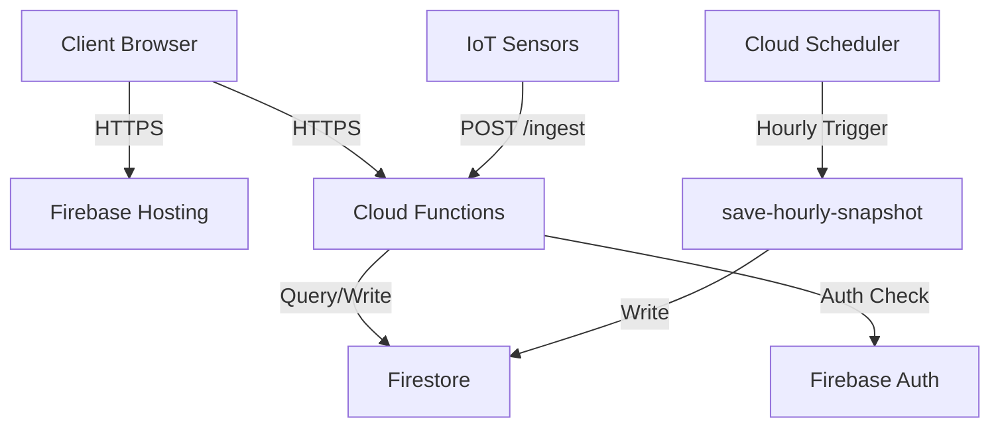

## Architecture Overview

S-Parking leverages Google Cloud Platform's serverless infrastructure to deliver a scalable, cost-effective parking management system. The architecture is built on **Cloud Functions** (2nd gen) and **Firestore** as the primary database.

<CardGroup cols={2}>
  <Card title="Serverless Design" icon="server">
    No server management required. Functions auto-scale based on demand.
  </Card>
  <Card title="Pay-per-use" icon="dollar-sign">
    Only pay for actual invocations and compute time.
  </Card>
  <Card title="Global CDN" icon="globe">
    Firebase Hosting with automatic SSL and edge caching.
  </Card>
  <Card title="Real-time Database" icon="database">
    Firestore provides millisecond-latency queries with real-time listeners.
  </Card>
</CardGroup>

## GCP Services Used

### Cloud Functions (2nd Gen)

All backend logic runs as HTTP-triggered Cloud Functions deployed on Cloud Run. Each function is independently deployable and scalable.

**Key Features:**
- **Concurrency**: Handles multiple requests per instance
- **Cold Start Optimization**: ~500ms startup time
- **CORS Support**: Pre-configured for web client access
- **Environment**: Node.js 20 runtime

**Package Dependencies:**
```json
{
  "@google-cloud/firestore": "^7.1.0",
  "@google-cloud/functions-framework": "^3.3.0",
  "cors": "^2.8.5"
}
```

### Firestore (Native Mode)

Firestore serves as the primary NoSQL database with three main collections:

- **`parking_spots`** - Real-time parking spot status
- **`parking_zones`** - Zone definitions and metadata
- **`occupancy_history`** - Hourly snapshots for analytics

See [Firestore Schema](/backend/firestore-schema) for detailed structure.

### Firebase Hosting

Static assets and the web dashboard are served via Firebase Hosting:

```json
{
  "hosting": {
    "public": ".",
    "ignore": ["gcp-functions/**", "**/node_modules/**"],
    "headers": [
      {
        "source": "**/*.html",
        "headers": [{"key": "Cache-Control", "value": "no-cache"}]
      },
      {
        "source": "js/**",
        "headers": [{"key": "Cache-Control", "value": "public, max-age=86400"}]
      }
    ]
  }
}
```

### Firebase Authentication

Email/password authentication with custom claims for admin access. See [Authentication](/backend/authentication) for implementation details.

## Scalability & Performance

### Auto-scaling Strategy

<Tabs>
  <Tab title="Low Load (0-10 req/s)">
    - **Instances**: 1-2 warm instances per function
    - **Latency**: Less than 200ms average
    - **Cost**: ~$5-10/month
  </Tab>
  <Tab title="Medium Load (10-100 req/s)">
    - **Instances**: Auto-scales to 5-20 instances
    - **Latency**: Less than 300ms average
    - **Cost**: Scales linearly with usage
  </Tab>
  <Tab title="High Load (100+ req/s)">
    - **Instances**: Scales to configured max (default 100)
    - **Latency**: Less than 500ms average
    - **Cost**: Optimized with connection pooling
  </Tab>
</Tabs>

### Optimization Techniques

**Client-side Caching**
```javascript
PERFORMANCE: {
  POLLING_INTERVAL: 20000,         // Poll every 20s
  CACHE_PARKING_STATUS: 15000,     // Cache parking status 15s
  CACHE_ZONES: 5 * 60 * 1000,      // Cache zones 5 min
  CACHE_HISTORY: 10 * 60 * 1000    // Cache history 10 min
}
```

**Database Indexes**
- `parking_spots`: Indexed on `status`, `zone_id`
- `occupancy_history`: Composite index on `ts` + `zone_id`

**Batch Operations**
```javascript
const batch = firestore.batch();
expiredSpots.forEach(spot => {
  batch.update(spot.ref, { status: 1 });
});
await batch.commit();
```

## Deployment Architecture



## Regional Configuration

**Primary Region**: `us-central1` (Iowa, USA)
- Lowest latency for North/South America
- Best pricing tier
- High availability zone

**Firestore Multi-region**: `nam5` (United States)
- Automatic replication across multiple data centers
- 99.999% uptime SLA

## Monitoring & Logging

All functions log to **Cloud Logging** with structured logging:

```javascript
console.log(`Reserva exitosa para ${spot_id}, Placa: ${license_plate}`);
console.warn("Error en reserva:", error.message);
console.error("🔥 ERROR CRÍTICO:", error);
```

**Log Retention**: 30 days (configurable)
**Alerts**: Set up Cloud Monitoring alerts for:
- Error rate > 5%
- Latency > 1s (p95)
- Cold starts > 100/hour

## Cost Optimization

<CardGroup cols={2}>
  <Card title="Function Optimization" icon="bolt">
    - Use connection pooling
    - Minimize cold starts
    - Set appropriate memory limits (256MB default)
  </Card>
  <Card title="Database Optimization" icon="coins">
    - Use batch writes (saves 90% writes)
    - Implement client-side caching
    - Set up data retention policies
  </Card>
  <Card title="Hosting Optimization" icon="rocket">
    - Enable CDN caching
    - Compress assets with gzip
    - Use lazy loading for images
  </Card>
  <Card title="Monitoring Budget" icon="chart-line">
    - Set up budget alerts
    - Monitor per-function costs
    - Review unused indexes
  </Card>
</CardGroup>

**Estimated Monthly Costs** (100 parking spots, 1000 daily users):
- Cloud Functions: $15-25
- Firestore: $10-15 (50K reads/day, 5K writes/day)
- Firebase Hosting: $0 (under free tier)
- **Total**: ~$25-40/month

## Security Considerations

- **CORS**: Configured to accept requests from authorized domains only
- **HTTPS Only**: All traffic encrypted via TLS 1.3
- **Rate Limiting**: Implemented at Cloud Functions level
- **Input Validation**: All endpoints validate request parameters
- **Firestore Rules**: Strict read/write rules based on authentication

See [Authentication](/backend/authentication) for detailed security implementation.