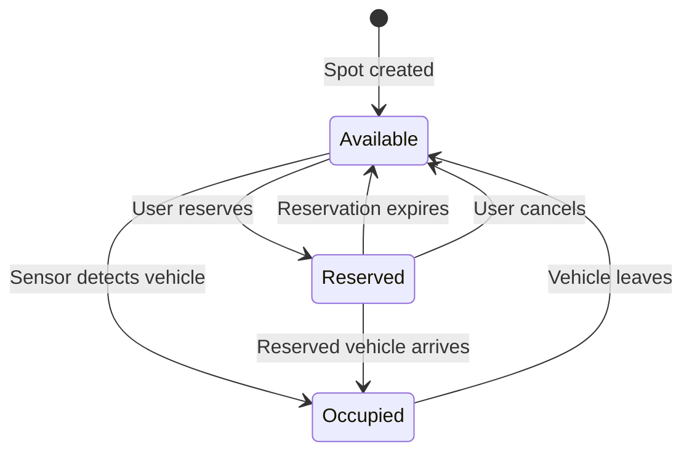

## Database Structure

S-Parking uses **Firestore in Native Mode** with three primary collections:

<CardGroup cols={3}>
  <Card title="parking_spots" icon="square-parking">
    Real-time status of all parking spots
  </Card>
  <Card title="parking_zones" icon="map-location-dot">
    Zone definitions and metadata
  </Card>
  <Card title="occupancy_history" icon="chart-line">
    Hourly snapshots for analytics
  </Card>
</CardGroup>

## Collection: `parking_spots`

Stores real-time state of each parking spot. Document ID is the spot identifier (e.g., `A-01`, `I-16`).

### Document Schema

<ResponseField name="id" type="string" required>
  Uppercase spot identifier (e.g., `A-01`, `I-16`). Same as document ID.
</ResponseField>

<ResponseField name="lat" type="number" required>
  Latitude coordinate (e.g., `-33.4489`).
</ResponseField>

<ResponseField name="lng" type="number" required>
  Longitude coordinate (e.g., `-70.6693`).
</ResponseField>

<ResponseField name="status" type="number" required>
  Current status:
  - `0` = Occupied (vehicle detected)
  - `1` = Available (free)
  - `2` = Reserved (user reservation active)
</ResponseField>

<ResponseField name="desc" type="string">
  Human-readable description (e.g., `Puesto A-01`).
</ResponseField>

<ResponseField name="zone_id" type="string">
  Foreign key to `parking_zones` collection (e.g., `zone_1764307623391`).
</ResponseField>

<ResponseField name="last_changed" type="timestamp">
  Server timestamp of last status change. Updated via `FieldValue.serverTimestamp()`.
</ResponseField>

<ResponseField name="reservation_data" type="object">
  Present only when `status = 2`. Contains:
  
  <ResponseField name="license_plate" type="string">
    Vehicle license plate number.
  </ResponseField>
  
  <ResponseField name="expires_at" type="timestamp">
    Reservation expiration time.
  </ResponseField>
  
  <ResponseField name="duration" type="number">
    Reservation duration in minutes.
  </ResponseField>
</ResponseField>

<ResponseField name="created_at" type="timestamp">
  Document creation timestamp.
</ResponseField>

<ResponseField name="updated_at" type="timestamp">
  Last update timestamp.
</ResponseField>

### Example Document

```json
{
  "id": "A-01",
  "lat": -33.4489,
  "lng": -70.6693,
  "status": 2,
  "desc": "Puesto A-01",
  "zone_id": "zone_1764307623391",
  "last_changed": {"_seconds": 1709673600, "_nanoseconds": 0},
  "reservation_data": {
    "license_plate": "ABCD12",
    "expires_at": {"_seconds": 1709677200, "_nanoseconds": 0},
    "duration": 60
  },
  "created_at": {"_seconds": 1709670000, "_nanoseconds": 0},
  "updated_at": {"_seconds": 1709673600, "_nanoseconds": 0}
}
```

### Status State Machine



### Firestore Operations

<Tabs>
  <Tab title="Create Spot">
    ```javascript
    await firestore.collection('parking_spots').doc('A-01').set({
      id: 'A-01',
      lat: -33.4489,
      lng: -70.6693,
      desc: 'Puesto A-01',
      status: 1,
      zone_id: 'zone_1764307623391',
      created_at: new Date(),
      updated_at: new Date()
    }, { merge: true });
    ```
  </Tab>
  <Tab title="Reserve Spot">
    ```javascript
    await firestore.runTransaction(async (t) => {
      const doc = await t.get(docRef);
      const data = doc.data();
      
      if (data.status === 0) {
        throw new Error("Spot occupied");
      }
      if (data.status === 2) {
        throw new Error("Already reserved");
      }
      
      const expirationTime = new Date();
      expirationTime.setMinutes(expirationTime.getMinutes() + 60);
      
      t.update(docRef, {
        status: 2,
        last_changed: FieldValue.serverTimestamp(),
        reservation_data: {
          license_plate: 'ABCD12',
          expires_at: expirationTime,
          duration: 60
        }
      });
    });
    ```
  </Tab>
  <Tab title="Query by Zone">
    ```javascript
    const snapshot = await firestore
      .collection('parking_spots')
      .where('zone_id', '==', 'zone_1764307623391')
      .get();
    
    snapshot.forEach(doc => {
      console.log(doc.id, doc.data());
    });
    ```
  </Tab>
</Tabs>

## Collection: `parking_zones`

Stores parking zone definitions. Document ID is the zone identifier (e.g., `zone_1764307623391`).

### Document Schema

<ResponseField name="id" type="string" required>
  Unique zone identifier (e.g., `zone_1764307623391`).
</ResponseField>

<ResponseField name="name" type="string" required>
  Display name (e.g., `Federico Froebel`, `Interior DUOC`).
</ResponseField>

<ResponseField name="order" type="number" required>
  Sort order for display (ascending). Used in UI to order zone tabs.
</ResponseField>

<ResponseField name="desc" type="string">
  Zone description.
</ResponseField>

<ResponseField name="color" type="string">
  Color identifier for UI (e.g., `blue`, `green`, `red`).
</ResponseField>

<ResponseField name="created_at" type="timestamp">
  Zone creation timestamp.
</ResponseField>

<ResponseField name="updated_at" type="timestamp">
  Last modification timestamp.
</ResponseField>

### Example Document

```json
{
  "id": "zone_1764307623391",
  "name": "Federico Froebel",
  "order": 1,
  "desc": "Estacionamiento exterior en calle Federico Froebel",
  "color": "blue",
  "created_at": {"_seconds": 1764307623, "_nanoseconds": 391000000},
  "updated_at": {"_seconds": 1764307623, "_nanoseconds": 391000000}
}
```

### Firestore Operations

<Tabs>
  <Tab title="Create Zone">
    ```javascript
    const zoneId = `zone_${Date.now()}`;
    
    await firestore.collection('parking_zones').doc(zoneId).set({
      id: zoneId,
      name: 'Nueva Zona',
      order: 999,
      desc: 'Descripción de la zona',
      color: 'blue',
      created_at: new Date(),
      updated_at: new Date()
    });
    ```
  </Tab>
  <Tab title="Update Zone">
    ```javascript
    const updateData = {
      name: 'Nombre Actualizado',
      updated_at: new Date()
    };
    
    if (order !== undefined) updateData.order = order;
    if (desc !== undefined) updateData.desc = desc;
    if (color !== undefined) updateData.color = color;
    
    await firestore.collection('parking_zones').doc(zoneId).update(updateData);
    ```
  </Tab>
  <Tab title="Get Zones (Ordered)">
    ```javascript
    const snapshot = await firestore
      .collection('parking_zones')
      .orderBy('order', 'asc')
      .get();
    
    const zones = [];
    snapshot.forEach(doc => zones.push(doc.data()));
    ```
  </Tab>
</Tabs>

## Collection: `occupancy_history`

Stores hourly snapshots of parking occupancy for analytics. Document ID is the hour key (e.g., `2026-03-05-14`).

### Document Schema

<ResponseField name="hour_key" type="string" required>
  Unique hour identifier in format `YYYY-MM-DD-HH` (UTC). Example: `2026-03-05-14`.
</ResponseField>

<ResponseField name="timestamp" type="string" required>
  ISO 8601 timestamp for audit purposes (e.g., `2026-03-05T14:00:00.000Z`).
</ResponseField>

<ResponseField name="ts" type="number" required>
  Unix timestamp in milliseconds. Used for efficient range queries.
</ResponseField>

<ResponseField name="global" type="object" required>
  Global occupancy statistics:
  
  <ResponseField name="free" type="number">
    Number of available spots.
  </ResponseField>
  
  <ResponseField name="occupied" type="number">
    Number of occupied spots.
  </ResponseField>
  
  <ResponseField name="reserved" type="number">
    Number of reserved spots.
  </ResponseField>
  
  <ResponseField name="total" type="number">
    Total spots in system.
  </ResponseField>
  
  <ResponseField name="occupancyPct" type="number">
    Occupancy percentage: `(occupied + reserved) / total * 100`, rounded to integer.
  </ResponseField>
</ResponseField>

<ResponseField name="zones" type="object" required>
  Map of zone statistics. Keys are zone IDs, values are objects with:
  
  <ResponseField name="free" type="number">
    Available spots in zone.
  </ResponseField>
  
  <ResponseField name="occupied" type="number">
    Occupied spots in zone.
  </ResponseField>
  
  <ResponseField name="reserved" type="number">
    Reserved spots in zone.
  </ResponseField>
  
  <ResponseField name="total" type="number">
    Total spots in zone.
  </ResponseField>
  
  <ResponseField name="occupancyPct" type="number">
    Zone occupancy percentage.
  </ResponseField>
</ResponseField>

<ResponseField name="created_at" type="timestamp">
  Snapshot creation timestamp.
</ResponseField>

### Example Document

```json
{
  "hour_key": "2026-03-05-14",
  "timestamp": "2026-03-05T14:00:00.000Z",
  "ts": 1709643600000,
  "global": {
    "free": 8,
    "occupied": 25,
    "reserved": 3,
    "total": 36,
    "occupancyPct": 78
  },
  "zones": {
    "zone_1764307623391": {
      "free": 5,
      "occupied": 13,
      "reserved": 2,
      "total": 20,
      "occupancyPct": 75
    },
    "zone_1764306251630": {
      "free": 3,
      "occupied": 12,
      "reserved": 1,
      "total": 16,
      "occupancyPct": 81
    }
  },
  "created_at": {"_seconds": 1709643600, "_nanoseconds": 0}
}
```

### Snapshot Generation Logic

```javascript
function buildHourKey(date = new Date()) {
  const y = date.getUTCFullYear();
  const m = String(date.getUTCMonth() + 1).padStart(2, '0');
  const d = String(date.getUTCDate()).padStart(2, '0');
  const h = String(date.getUTCHours()).padStart(2, '0');
  return `${y}-${m}-${d}-${h}`;
}

function addStatusCounts(acc, status) {
  if (!acc.total) acc.total = 0;
  acc.total += 1;
  if (status === 1) acc.free = (acc.free || 0) + 1;
  else if (status === 0) acc.occupied = (acc.occupied || 0) + 1;
  else if (status === 2) acc.reserved = (acc.reserved || 0) + 1;
}
```

### Firestore Operations

<Tabs>
  <Tab title="Query Last 7 Days">
    ```javascript
    const days = 7;
    const startTs = Date.now() - days * 24 * 60 * 60 * 1000;
    
    const snapshot = await firestore
      .collection('occupancy_history')
      .where('ts', '>=', startTs)
      .orderBy('ts', 'asc')
      .get();
    
    const samples = [];
    snapshot.forEach(doc => samples.push(doc.data()));
    ```
  </Tab>
  <Tab title="Save Hourly Snapshot">
    ```javascript
    const hourKey = buildHourKey(new Date());
    const docData = {
      hour_key: hourKey,
      timestamp: new Date().toISOString(),
      ts: Date.now(),
      global: { /* computed stats */ },
      zones: { /* computed per-zone stats */ },
      created_at: new Date()
    };
    
    await firestore
      .collection('occupancy_history')
      .doc(hourKey)
      .set(docData, { merge: true });
    ```
  </Tab>
  <Tab title="Data Retention (30 days)">
    ```javascript
    const cutoffMs = Date.now() - 30 * 24 * 60 * 60 * 1000;
    
    const oldQuery = await firestore
      .collection('occupancy_history')
      .where('ts', '<', cutoffMs)
      .get();
    
    if (!oldQuery.empty) {
      const batch = firestore.batch();
      oldQuery.docs.forEach(doc => batch.delete(doc.ref));
      await batch.commit();
      console.log(`Deleted ${oldQuery.size} old snapshots`);
    }
    ```
  </Tab>
</Tabs>

## Indexes

### Required Composite Indexes

<CardGroup cols={2}>
  <Card title="occupancy_history" icon="magnifying-glass">
    **Fields:**
    - `ts` (Ascending)
    - `zone_id` (Ascending)
    
    Used for time-range queries filtered by zone.
  </Card>
  <Card title="parking_spots" icon="magnifying-glass">
    **Fields:**
    - `zone_id` (Ascending)
    - `status` (Ascending)
    
    Used for zone-filtered status queries.
  </Card>
</CardGroup>

### Single-field Indexes (Automatic)

- `parking_spots.status`
- `parking_spots.zone_id`
- `parking_zones.order`
- `occupancy_history.ts`

## Transaction Patterns

S-Parking uses Firestore transactions for atomic operations that require read-modify-write consistency.

### Reserve Parking Spot Transaction

```javascript
await firestore.runTransaction(async (t) => {
  const doc = await t.get(docRef);
  
  if (!doc.exists) {
    throw new Error("Spot does not exist");
  }
  
  const data = doc.data();
  
  // Validate current state
  if (data.status === 0) {
    throw new Error("Spot occupied by vehicle");
  }
  if (data.status === 2) {
    throw new Error("Spot already reserved");
  }
  
  // Calculate expiration
  const expirationTime = new Date();
  expirationTime.setMinutes(expirationTime.getMinutes() + duration_minutes);
  
  // Atomic update
  t.update(docRef, {
    status: 2,
    last_changed: FieldValue.serverTimestamp(),
    reservation_data: {
      license_plate,
      expires_at: expirationTime,
      duration: duration_minutes
    }
  });
});
```

### Release Parking Spot Transaction

```javascript
await firestore.runTransaction(async (t) => {
  const doc = await t.get(docRef);
  if (!doc.exists) throw new Error("Spot does not exist");
  
  const data = doc.data();
  
  if (data.status !== 2) {
    throw new Error("No active reservation to cancel");
  }
  
  t.update(docRef, {
    status: 1,
    last_changed: FieldValue.serverTimestamp(),
    reservation_data: FieldValue.delete()
  });
});
```

## Best Practices

<CardGroup cols={2}>
  <Card title="Use Transactions" icon="lock">
    Always use transactions for reserve/release operations to prevent race conditions.
  </Card>
  <Card title="Batch Writes" icon="layer-group">
    Use batch writes when updating multiple documents (e.g., expiring reservations).
  </Card>
  <Card title="Server Timestamps" icon="clock">
    Use `FieldValue.serverTimestamp()` for consistent timestamps across timezones.
  </Card>
  <Card title="Data Retention" icon="calendar-xmark">
    Implement automated cleanup for `occupancy_history` (30-day retention).
  </Card>
</CardGroup>