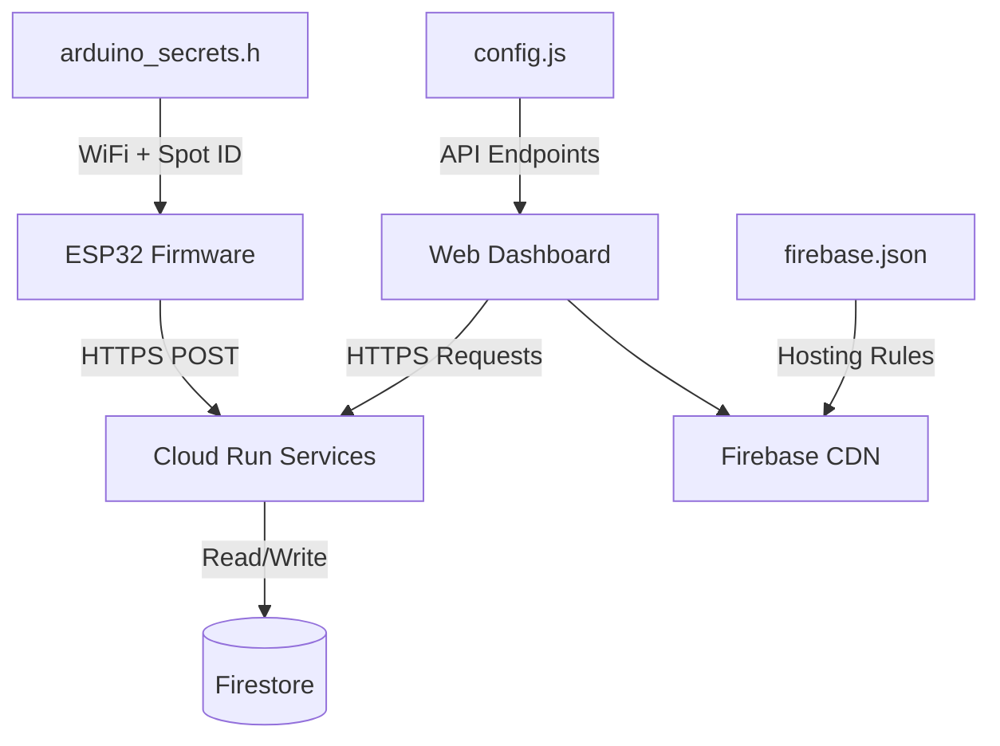

S-Parking requires coordinated configuration across three layers: **ESP32 firmware**, **Cloud Run backend**, and **web dashboard**. This guide covers secrets management and environment setup for production deployment.

## Configuration Architecture

The S-Parking system uses a **distributed configuration model**:



1. **Firmware**: `arduino_secrets.h` (WiFi, Cloud Run URLs, Spot ID)
2. **Backend**: Environment variables in Cloud Run
3. **Frontend**: `config.js` (API URLs, Firebase config, Google Maps key)

## Frontend Configuration (config.js)

### Setup Process

<Steps>
  <Step title="Copy Template">
    ```bash
    cd web-dashboard/js/config
    cp config.example.js config.js
    ```
  </Step>

  <Step title="Add to .gitignore">
    ```bash
    echo "js/config/config.js" >> .gitignore
    ```
    **Critical**: Never commit `config.js` with real credentials!
  </Step>

  <Step title="Configure Values">
    Edit `config.js` with your production settings (see below).
  </Step>
</Steps>

### Configuration Structure

```javascript js/config/config.js
export const CONFIG = {
    // Debug mode (disable in production)
    DEBUG: false,
    
    // --- PERFORMANCE TUNING ---
    PERFORMANCE: {
        POLLING_INTERVAL: 20000,         // 20s - main polling interval
        HISTORY_REFRESH: 10 * 60 * 1000, // 10min - refresh analytics
        TIMER_UPDATE: 5000,              // 5s - update UI timers
        CACHE_PARKING_STATUS: 15000,     // 15s - cache parking status
        CACHE_ZONES: 5 * 60 * 1000,      // 5min - cache zones
        CACHE_HISTORY: 10 * 60 * 1000,   // 10min - cache history
        DEBOUNCE_SEARCH: 400,            // 400ms - debounce search input
        LAZY_RENDER: true                // Enable lazy rendering
    },
    
    // --- GOOGLE MAPS CREDENTIALS ---
    GOOGLE_MAPS_API_KEY: "AIzaSy...",  // Your API key
    GOOGLE_MAPS_ID: "abc123...",        // Your Map ID
    
    // --- CLOUD RUN API ENDPOINTS ---
    GET_STATUS_API_URL: "https://get-parking-status-[hash]-uc.a.run.app",
    RESERVATION_API_URL: "https://reserve-parking-spot-[hash]-uc.a.run.app",
    RELEASE_API_URL: "https://release-parking-spot-[hash]-uc.a.run.app",
    CREATE_SPOT_URL: "https://create-parking-spot-[hash]-uc.a.run.app",
    DELETE_SPOT_URL: "https://delete-parking-spot-[hash]-uc.a.run.app",
    GET_ZONES_URL: "https://get-zones-[hash]-uc.a.run.app",
    MANAGE_ZONES_URL: "https://manage-zones-[hash]-uc.a.run.app",
    GET_HISTORY_URL: "https://get-occupancy-history-[hash]-uc.a.run.app",

    // --- ANALYTICS THRESHOLDS ---
    RECOMMENDATIONS: {
        CRITICAL_OCCUPANCY_PCT: 80,  // % occupancy for critical alert
        CRITICAL_TIME_HIGH: 30,      // % time in critical to suggest expansion
        CRITICAL_TIME_MED: 10,       // % time in critical for warning
        VARIABILITY_HIGH: 30,        // High variability coefficient (%)
        VARIABILITY_MED: 15,         // Medium variability coefficient (%)
        AVAIL_GOOD: 40,              // Good availability threshold (%)
        AVAIL_LOW: 20,               // Low availability threshold (%)
        PEAK_THRESHOLD: 70,          // Peak hour threshold (%)
        MORNING_RANGE: [7, 10],      // Morning peak hours
        EVENING_RANGE: [17, 20],     // Evening peak hours
        MAX_ITEMS: 4                 // Max recommendations to show
    },

    // --- FIREBASE CONFIGURATION ---
    FIREBASE: {
        apiKey: "AIzaSyD...",
        authDomain: "your-project.firebaseapp.com",
        projectId: "your-project-id",
        storageBucket: "your-project.appspot.com",
        messagingSenderId: "123456789012",
        appId: "1:123456789012:web:abcdef123456"
    }
};

// Backward compatibility for legacy code
window.CONFIG = CONFIG;
```

### Configuration Parameters

#### Debug Mode

```javascript
DEBUG: false  // Set to true for verbose console logging
```

<Warning>
**Always set `DEBUG: false` in production!** Debug mode logs sensitive API calls and user actions to the console.
</Warning>

#### Performance Settings

S-Parking implements **Page Visibility API** to reduce costs:

- When tab is **active**: Normal polling intervals
- When tab is **inactive**: Polling pauses (saves 80% Firestore reads)

```javascript
PERFORMANCE: {
    POLLING_INTERVAL: 20000,  // Increase to 30000 for low-traffic sites
    CACHE_PARKING_STATUS: 15000,  // Balance freshness vs. API calls
}
```

#### Google Maps API Key

Obtain from [Google Cloud Console](https://console.cloud.google.com/google/maps-apis):

1. Enable **Maps JavaScript API**
2. Create API key
3. Restrict key to your domain:
   ```
   Website restrictions:
   https://your-project.web.app/*
   https://your-custom-domain.com/*
   ```

#### Cloud Run URLs

Get service URLs after deployment:

```bash
gcloud run services list --platform managed --format="value(status.url)"
```

Output:
```
https://get-parking-status-abc123-uc.a.run.app
https://reserve-parking-spot-def456-uc.a.run.app
...
```

Copy each URL to the corresponding `CONFIG` field.

#### Firebase Configuration

From Firebase Console → Project Settings → General:

```javascript
FIREBASE: {
    apiKey: "AIzaSyD...",           // Web API Key
    authDomain: "project.firebaseapp.com",
    projectId: "your-project-id",   // Project ID
    storageBucket: "project.appspot.com",
    messagingSenderId: "123456789012",
    appId: "1:123456789012:web:abc123"
}
```

<Note>
Firebase config is **not secret** and can be safely embedded in frontend code. Authentication is enforced via Firestore Security Rules.
</Note>

## Backend Configuration (Cloud Run)

### Environment Variables

Set during Cloud Run deployment:

```bash
gcloud run deploy YOUR_SERVICE \
  --image gcr.io/PROJECT_ID/YOUR_SERVICE \
  --set-env-vars \
    FIRESTORE_COLLECTION=parking_spots,\
    NODE_ENV=production,\
    LOG_LEVEL=info
```

### Standard Environment Variables

| Variable | Description | Default | Example |
|----------|-------------|---------|----------|
| `FIRESTORE_COLLECTION` | Main collection name | `parking_spots` | `parking_spots` |
| `NODE_ENV` | Runtime environment | `production` | `production`, `development` |
| `LOG_LEVEL` | Logging verbosity | `info` | `debug`, `info`, `warn`, `error` |
| `CORS_ORIGIN` | Allowed CORS origins | `*` | `https://your-domain.com` |

### Update Environment Variables

```bash
# Update single variable
gcloud run services update ingest-parking-data \
  --update-env-vars LOG_LEVEL=debug

# View current env vars
gcloud run services describe ingest-parking-data \
  --format="value(spec.template.spec.containers[0].env)"
```

## Firmware Configuration (arduino_secrets.h)

### Structure

```cpp arduino_secrets.h
#pragma once

// --- WIFI CREDENTIALS ---
#define SECRET_SSID "ParkingLot_WiFi_5G"
#define SECRET_PASS "SecurePassword123!"

// --- GOOGLE CLOUD ENDPOINTS ---
// 1. Ingest endpoint (ESP32 sends sensor data here)
#define SECRET_GCP_URL_INGEST "https://ingest-parking-data-abc123-uc.a.run.app"

// 2. Status endpoint (ESP32 reads reservation status)
#define SECRET_GCP_URL_GET "https://get-parking-status-abc123-uc.a.run.app"

// --- PARKING SPOT IDENTIFIER ---
#define SECRET_SPOT_ID "A-01"
```

### Per-Device Configuration

For deployments with multiple ESP32 devices:

<Steps>
  <Step title="Create Secrets Template">
    ```bash
    cd firmware/S-Parking
    cp arduino_secrets.example.h arduino_secrets.template.h
    ```
  </Step>

  <Step title="Generate Device-Specific Files">
    ```bash
    #!/bin/bash
    # deploy_devices.sh
    
    SPOTS=("A-01" "A-02" "A-03" "B-01" "B-02")
    
    for spot in "${SPOTS[@]}"; do
      cp arduino_secrets.template.h arduino_secrets.h
      sed -i "s/SECRET_SPOT_ID \".*\"/SECRET_SPOT_ID \"$spot\"/" arduino_secrets.h
      
      # Upload to connected ESP32
      platformio run --target upload
      
      echo "Deployed $spot - Please swap ESP32 device"
      read -p "Press Enter when ready..."
    done
    ```
  </Step>

  <Step title="Label Devices">
    Use physical labels or engraving to mark each ESP32 with its Spot ID.
  </Step>
</Steps>

<Warning>
**Never commit `arduino_secrets.h` to version control!** Add to `.gitignore`:
```
firmware/S-Parking/arduino_secrets.h
```
</Warning>

## Secrets Management Best Practices

### 1. Use Secret Manager (Recommended)

For production, use Google Cloud Secret Manager:

<Steps>
  <Step title="Store Secret">
    ```bash
    echo -n "your-api-key" | gcloud secrets create api-key --data-file=-
    ```
  </Step>

  <Step title="Grant Access to Cloud Run">
    ```bash
    gcloud secrets add-iam-policy-binding api-key \
      --member serviceAccount:YOUR_SERVICE_ACCOUNT@PROJECT.iam.gserviceaccount.com \
      --role roles/secretmanager.secretAccessor
    ```
  </Step>

  <Step title="Mount in Cloud Run">
    ```bash
    gcloud run deploy YOUR_SERVICE \
      --image gcr.io/PROJECT_ID/YOUR_SERVICE \
      --update-secrets API_KEY=api-key:latest
    ```
  </Step>

  <Step title="Access in Code">
    ```javascript
    const apiKey = process.env.API_KEY;
    ```
  </Step>
</Steps>

### 2. Environment-Specific Configs

Maintain separate configs for staging/production:

```
js/config/
├── config.example.js    # Template with placeholders
├── config.staging.js    # Staging environment
└── config.production.js # Production environment
```

Symlink appropriate file during deployment:
```bash
ln -sf config.production.js config.js
```

### 3. CI/CD Secrets Injection

For GitHub Actions:

```yaml .github/workflows/deploy.yml
env:
  GOOGLE_MAPS_API_KEY: ${{ secrets.GOOGLE_MAPS_API_KEY }}
  FIREBASE_API_KEY: ${{ secrets.FIREBASE_API_KEY }}

steps:
  - name: Generate config.js
    run: |
      sed "s/{{GOOGLE_MAPS_API_KEY}}/$GOOGLE_MAPS_API_KEY/g" \
        js/config/config.template.js > js/config/config.js
```

## Configuration Validation

### Frontend Validation

Add to `config.js`:

```javascript
// Validate configuration
export function validateConfig() {
    const required = [
        'GOOGLE_MAPS_API_KEY',
        'GET_STATUS_API_URL',
        'FIREBASE.apiKey'
    ];
    
    for (const key of required) {
        const value = key.includes('.') 
            ? CONFIG[key.split('.')[0]][key.split('.')[1]]
            : CONFIG[key];
        
        if (!value || value.includes('TU_') || value.includes('[hash]')) {
            console.error(`❌ Config error: ${key} not set`);
            return false;
        }
    }
    
    console.log('✅ Configuration valid');
    return true;
}

// Call on app initialization
if (CONFIG.DEBUG) validateConfig();
```

### Backend Validation

Add to Cloud Run functions:

```javascript index.js
const requiredEnv = ['FIRESTORE_COLLECTION', 'NODE_ENV'];

requiredEnv.forEach(key => {
    if (!process.env[key]) {
        throw new Error(`Missing required env var: ${key}`);
    }
});
```

## Troubleshooting

### Issue: "API key not valid" (Google Maps)

**Solution**: 
1. Check API key restrictions in Google Cloud Console
2. Verify Maps JavaScript API is enabled
3. Clear browser cache and hard refresh

### Issue: CORS errors calling Cloud Run

**Solution**: Ensure Cloud Run functions include CORS headers:

```javascript
const cors = require('cors')({origin: true});

exports.yourFunction = (req, res) => {
    cors(req, res, () => {
        // Function logic
    });
};
```

### Issue: ESP32 returns HTTP 401/403

**Solution**: 
1. Verify Cloud Run service allows unauthenticated requests:
   ```bash
   gcloud run services add-iam-policy-binding ingest-parking-data \
     --member="allUsers" \
     --role="roles/run.invoker"
   ```
2. Check URL in `arduino_secrets.h` is correct

### Issue: Firebase "Permission denied"

**Solution**: Update Firestore Security Rules:

```javascript
rules_version = '2';
service cloud.firestore {
  match /databases/{database}/documents {
    match /parking_spots/{spot} {
      allow read: if true;  // Public read
      allow write: if request.auth != null;  // Authenticated write
    }
  }
}
```

### Issue: Config changes not reflecting

**Solution**:
1. **Frontend**: Hard refresh (Ctrl+Shift+R) to bypass cache
2. **Backend**: Redeploy Cloud Run service
3. **Firmware**: Re-upload firmware to ESP32

## Configuration Checklist

Before production deployment:

<Steps>
  <Step title="Frontend">
    - [ ] `config.js` created from template
    - [ ] `DEBUG: false` set
    - [ ] All Cloud Run URLs updated
    - [ ] Google Maps API key configured
    - [ ] Firebase config added
    - [ ] `config.js` added to `.gitignore`
  </Step>

  <Step title="Backend">
    - [ ] Environment variables set on all Cloud Run services
    - [ ] CORS configured for frontend domain
    - [ ] Firestore collection names consistent
    - [ ] Service accounts have required permissions
  </Step>

  <Step title="Firmware">
    - [ ] `arduino_secrets.h` created for each device
    - [ ] WiFi credentials correct
    - [ ] Cloud Run URLs match deployed services
    - [ ] Spot IDs unique per device
    - [ ] `arduino_secrets.h` added to `.gitignore`
  </Step>

  <Step title="Security">
    - [ ] No secrets committed to git
    - [ ] API keys restricted to production domains
    - [ ] Firestore security rules enforced
    - [ ] Cloud Run authentication configured appropriately
  </Step>
</Steps>

## Next Steps

<Card title="Deploy Cloud Run Services" icon="server" href="./cloud-run">
  Deploy backend microservices with environment variables
</Card>

<Card title="Deploy to Firebase Hosting" icon="globe" href="./firebase-hosting">
  Upload frontend with production config.js
</Card>

<Card title="Flash ESP32 Firmware" icon="microchip" href="./firmware-flashing">
  Program devices with arduino_secrets.h
</Card>