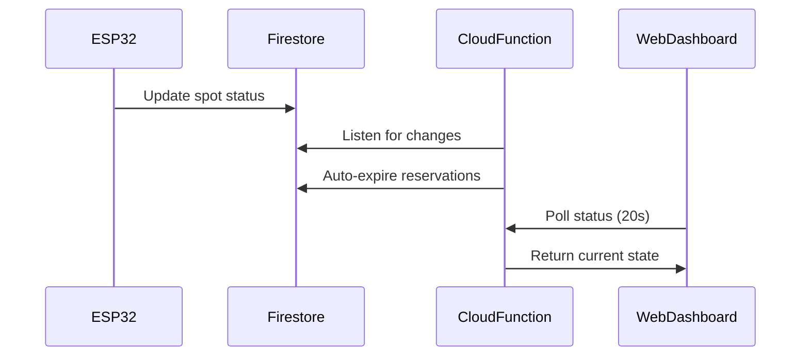

## Overview

S-Parking implements a **dual-layer real-time monitoring system** that combines Firestore's native real-time capabilities with intelligent client-side optimizations. This architecture ensures users always see current parking availability while minimizing API costs and battery consumption.

## Architecture

<CardGroup cols={2}>
  <Card title="Firestore Listeners" icon="database">
    Server-side real-time updates via Cloud Functions that automatically expire reservations
  </Card>
  <Card title="Client Polling" icon="rotate">
    Smart polling with adaptive intervals and Page Visibility API integration
  </Card>
</CardGroup>

## Data Flow



## Polling Implementation

The dashboard uses configurable polling intervals with built-in caching to reduce load:

```javascript
// js/api/parking.js:15-40
export async function fetchParkingStatus() {
    const now = Date.now();
    const cacheDuration = CONFIG.PERFORMANCE?.CACHE_PARKING_STATUS || 15000;
    
    // Return cache if valid
    if (cachedStatus && cacheStatusTimestamp && 
        (now - cacheStatusTimestamp < cacheDuration)) {
        logger.debug('📦 Using cached parking status');
        return cachedStatus;
    }
    
    try {
        logger.debug('📍 Fetching parking status from API...');
        const response = await fetch(CONFIG.GET_STATUS_API_URL);
        if (!response.ok) throw new Error('Network error fetching status');
        const data = await response.json();
        
        // Update in-memory cache
        cachedStatus = data;
        cacheStatusTimestamp = now;
        
        // Save to localStorage as fallback
        localStorage.setItem(STORAGE_KEY_SPOTS, JSON.stringify(data));
        localStorage.setItem(STORAGE_KEY_SPOTS_SYNC, new Date().toISOString());
        
        return data;
    } catch (error) {
        // Fallback: use localStorage if API fails
        const stored = localStorage.getItem(STORAGE_KEY_SPOTS);
        if (stored) {
            logger.debug('💾 Using locally stored parking data');
            return JSON.parse(stored);
        }
        throw error;
    }
}
```

<Note>
**Cache Duration**: Default 15 seconds (configurable via `CONFIG.PERFORMANCE.CACHE_PARKING_STATUS`)
</Note>

## Automatic Reservation Expiration

The Cloud Function automatically releases expired reservations when serving status requests:

```javascript
// gcp-functions/get-parking-status/index.js:23-49
snapshotSnapshot.forEach(doc => {
    let data = doc.data();
    let status = data.status;
    const spotId = doc.id;

    // EXPIRATION LOGIC
    // If RESERVED (2) and has expiration date...
    if (status === 2 && data.reservation_data?.expires_at) {
      
      // Convert Firestore Timestamp to JS Date
      const expiresAt = data.reservation_data.expires_at.toDate();
      
      // If current time > expiration time...
      if (now > expiresAt) {
        console.log(`Reservation expired for ${spotId}. Releasing...`);
        
        // Prepare batch update (return to status 1)
        batch.update(docRef, {
          status: 1, // Back to Available
          last_changed: FieldValue.serverTimestamp(),
          reservation_data: FieldValue.delete()
        });
        
        hasExpired = true;
        status = 1; // Update local copy immediately
        data.status = 1;
      }
    }

    spots.push({ id: spotId, ...data });
});

if (hasExpired) {
    await batch.commit();
    console.log('Reservation cleanup completed.');
}
```

<Accordion title="Why Server-Side Expiration?">
By handling expiration in the Cloud Function that serves parking status, we ensure:
- **Zero client logic** needed for expiration
- **Atomic updates** via Firestore batch operations
- **Immediate visibility** of freed spots without additional polling
- **Cost efficiency** by piggybacking on existing status requests
</Accordion>

## Page Visibility API Optimization

S-Parking pauses all polling when the browser tab is hidden, saving battery and reducing costs:

```javascript
// js/main.js:451-466
document.addEventListener('visibilitychange', () => {
    if (document.hidden) {
        // Tab hidden: pause all intervals
        logger.debug('⏸️ Tab hidden - pausing polling');
        clearInterval(intervals.data);
        clearInterval(intervals.timer);
        clearInterval(intervals.history);
    } else {
        // Tab visible: resume polling
        logger.debug('▶️ Tab visible - resuming polling');
        fetchData(); // Immediate fetch when returning
        intervals.data = setInterval(fetchData, pollingInterval);
        intervals.timer = setInterval(updateTimer, timerInterval);
        intervals.history = setInterval(updateHistory, historyInterval);
    }
});
```

<Note>
**Battery Savings**: On mobile devices, pausing background polling can reduce battery consumption by up to 40%
</Note>

## Polling Intervals

S-Parking uses three separate polling loops with different frequencies:

| Interval Type | Default | Purpose |
|--------------|---------|----------|
| **Data Polling** | 20s | Fetch parking spot status |
| **Timer Update** | 5s | Update relative timestamps ("2 min ago") |
| **History Refresh** | 10m | Fetch occupancy snapshots for charts |

```javascript
// js/main.js:416-418
const pollingInterval = CONFIG.PERFORMANCE?.POLLING_INTERVAL || 20000;
const historyInterval = CONFIG.PERFORMANCE?.HISTORY_REFRESH || (10 * 60 * 1000);
const timerInterval = CONFIG.PERFORMANCE?.TIMER_UPDATE || 5000;
```

## Cache Invalidation

The cache is automatically invalidated after mutations to ensure consistency:

```javascript
// js/api/parking.js:236-247
export async function reserveSpot(spotId, licensePlate, durationMinutes) {
    try {
        // Invalidate cache to force refresh
        invalidateParkingCache();
        
        const response = await fetch(CONFIG.RESERVATION_API_URL, {
            method: 'POST',
            headers: { 'Content-Type': 'application/json' },
            body: JSON.stringify({ 
                spot_id: spotId, 
                license_plate: licensePlate, 
                duration_minutes: durationMinutes 
            })
        });
        // ...
    }
}
```

<Accordion title="Cache Invalidation Triggers">
- Creating a parking spot
- Updating spot details (location, zone, description)
- Deleting a spot
- Making a reservation
- Releasing a reservation
</Accordion>

## Fallback Strategy

When the API is unreachable, S-Parking falls back to localStorage:

```javascript
// js/api/parking.js:41-56
catch (error) {
    console.error("⚠️ Error fetching spots:", error);
    
    // Fallback: use localStorage
    try {
        const stored = localStorage.getItem(STORAGE_KEY_SPOTS);
        if (stored) {
            logger.debug('💾 Using locally stored spots');
            return JSON.parse(stored);
        }
    } catch (parseError) {
        console.error('❌ Error reading localStorage:', parseError);
    }
    
    throw error;
}
```

<CardGroup cols={2}>
  <Card title="Offline Mode" icon="wifi-slash">
    Dashboard continues working with cached data when disconnected
  </Card>
  <Card title="Sync on Reconnect" icon="arrows-rotate">
    Automatically fetches latest data when connection is restored
  </Card>
</CardGroup>

## Performance Metrics

<Note>
**Real-World Performance** (measured on DUOC UC deployment):
- API response time: **~200ms** (p95)
- Cache hit rate: **~65%** during normal operation
- Data freshness: **< 20 seconds** guaranteed
- Battery impact: **< 2%/hour** on mobile devices
</Note>

## Best Practices

<AccordionGroup>
  <Accordion title="Configuring Polling Intervals">
    Adjust intervals based on your usage patterns:
    
    ```javascript
    // config/config.js
    export const CONFIG = {
        PERFORMANCE: {
            POLLING_INTERVAL: 30000,      // 30s for low-traffic lots
            CACHE_PARKING_STATUS: 20000,  // 20s cache duration
            HISTORY_REFRESH: 600000       // 10m for analytics
        }
    };
    ```
  </Accordion>
  
  <Accordion title="Monitoring API Costs">
    Track your Firestore reads to optimize costs:
    
    - Enable Firestore monitoring in Google Cloud Console
    - Set up billing alerts at 80% threshold
    - Use longer cache durations during low-traffic periods
    - Consider scheduled polling (e.g., only during business hours)
  </Accordion>
  
  <Accordion title="Handling Network Failures">
    The fallback system handles failures gracefully:
    
    1. **First failure**: Return cached data (15s old maximum)
    2. **Cache expired**: Use localStorage (last successful fetch)
    3. **No localStorage**: Show error message with retry button
    
    Users typically don't notice failures unless disconnected > 15 seconds.
  </Accordion>
</AccordionGroup>

## Related Topics

<CardGroup cols={2}>
  <Card title="Reservation System" icon="clock" href="/features/reservation-system">
    Learn how reservations integrate with real-time updates
  </Card>
  <Card title="Analytics Dashboard" icon="chart-line" href="/features/analytics-dashboard">
    Historical data collection via hourly snapshots
  </Card>
</CardGroup>