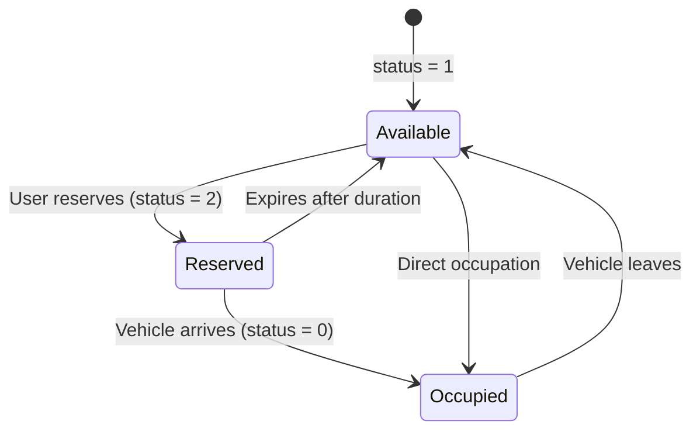

## Overview

S-Parking's reservation system allows users to **reserve available spots for a specific duration** (15-120 minutes). Reservations automatically expire without manual intervention, and the system prevents double-booking through Firestore transactions.

## Reservation Workflow



## Status Codes

| Status | Name | Color | Description |
|--------|------|-------|-------------|
| `1` | Available | Green | Spot is free and ready to use |
| `0` | Occupied | Red | Vehicle physically present |
| `2` | Reserved | Yellow | Reserved for specific duration |

## Making a Reservation

Reservations are created via a Cloud Function with transaction-based conflict prevention:

```javascript
// Client-side: js/api/parking.js:236-259
export async function reserveSpot(spotId, licensePlate, durationMinutes) {
    try {
        // Invalidate cache to force refresh
        invalidateParkingCache();
        
        const response = await fetch(CONFIG.RESERVATION_API_URL, {
            method: 'POST',
            headers: { 'Content-Type': 'application/json' },
            body: JSON.stringify({ 
                spot_id: spotId, 
                license_plate: licensePlate, 
                duration_minutes: durationMinutes 
            })
        });

        if (!response.ok) {
            const errData = await response.json();
            throw new Error(errData.message || 'Error making reservation');
        }
        
        return await response.json();
    } catch (error) {
        throw error; // Propagate error to show in modal
    }
}
```

<Note>
**License Plate Format**: The system validates Chilean license plates (e.g., `AB-1234`, `ABCD-12`)
</Note>

## Server-Side Transaction Logic

The Cloud Function uses **Firestore transactions** to prevent race conditions:

```javascript
// gcp-functions/reserve-parking-spot/index.js:24-57
try {
  // Use transaction to prevent race conditions
  await firestore.runTransaction(async (t) => {
    const doc = await t.get(docRef);

    if (!doc.exists) {
        throw new Error("Spot does not exist.");
    }

    const data = doc.data();
    
    // 0 = Occupied, 2 = Reserved
    if (data.status === 0) {
        throw new Error("Spot is occupied by a vehicle.");
    }
    if (data.status === 2) {
        throw new Error("Spot already has an active reservation.");
    }

    // Calculate expiration time
    const expirationTime = new Date();
    expirationTime.setMinutes(
        expirationTime.getMinutes() + parseInt(duration_minutes)
    );

    // Update to Status 2 (Reserved)
    t.update(docRef, {
        status: 2,
        last_changed: FieldValue.serverTimestamp(),
        reservation_data: {
            license_plate: license_plate,
            expires_at: expirationTime,
            duration: parseInt(duration_minutes)
        }
    });
  });

  res.status(200).json({ 
      success: true, 
      message: "Reservation successful" 
  });

} catch (error) {
  console.warn("Reservation error:", error.message);
  // Return 409 (Conflict) for reservation conflicts
  res.status(409).json({ error: error.message });
}
```

<Accordion title="Why Firestore Transactions?">
Firestore transactions provide **atomic read-modify-write** operations that:
- **Prevent double-booking**: Two users can't reserve the same spot simultaneously
- **Ensure consistency**: Status checks and updates happen atomically
- **Handle retries**: Firestore automatically retries transactions on conflicts
- **Guarantee isolation**: Changes aren't visible until transaction commits
</Accordion>

## Reservation Data Structure

Each reserved spot stores reservation metadata:

```json
{
  "id": "A-05",
  "status": 2,
  "lat": -33.4489,
  "lng": -70.6693,
  "zone_id": "zone_1764307623391",
  "last_changed": "2026-03-05T14:30:00Z",
  "reservation_data": {
    "license_plate": "AB-1234",
    "expires_at": "2026-03-05T15:00:00Z",
    "duration": 30
  }
}
```

<CardGroup cols={3}>
  <Card title="license_plate" icon="id-card">
    Vehicle identifier (validated format)
  </Card>
  <Card title="expires_at" icon="calendar-clock">
    Timestamp when reservation auto-expires
  </Card>
  <Card title="duration" icon="hourglass">
    Original duration in minutes
  </Card>
</CardGroup>

## Automatic Expiration

Reservations automatically expire without cron jobs or scheduled tasks. The expiration logic runs **every time parking status is fetched**:

```javascript
// gcp-functions/get-parking-status/index.js:23-49
if (status === 2 && data.reservation_data?.expires_at) {
  
  // Convert Firestore Timestamp to JS Date
  const expiresAt = data.reservation_data.expires_at.toDate();
  
  // If current time > expiration time...
  if (now > expiresAt) {
    console.log(`Reservation expired for ${spotId}. Releasing...`);
    
    // Batch update: return to status 1
    batch.update(docRef, {
      status: 1,                              // Back to Available
      last_changed: FieldValue.serverTimestamp(),
      reservation_data: FieldValue.delete()   // Remove reservation data
    });
    
    hasExpired = true;
    status = 1;       // Update local copy immediately
    data.status = 1;
  }
}
```

<Note>
**Lazy Expiration**: Reservations are cleaned up on-demand when status is requested, not on a schedule. This reduces costs and complexity.
</Note>

## Duration Presets

The dashboard offers predefined duration options:

<Tabs>
  <Tab title="Quick Options">
    | Duration | Use Case |
    |----------|----------|
    | 15 min | Quick errands |
    | 30 min | Short visits |
    | 60 min | Standard parking |
    | 90 min | Extended stay |
    | 120 min | Maximum allowed |
  </Tab>
  
  <Tab title="Custom Duration">
    Users can enter a custom duration between 5-120 minutes via the reservation modal:
    
    ```javascript
    // Validation logic
    const duration = parseInt(durationInput.value);
    if (duration < 5 || duration > 120) {
        showToast('Duration must be between 5-120 minutes', 'error');
        return;
    }
    ```
  </Tab>
</Tabs>

## Canceling Reservations

Users can release their reservation before it expires:

```javascript
// js/api/parking.js:264-280
export async function releaseSpot(spotId) {
    try {
        // Invalidate cache to force refresh
        invalidateParkingCache();
        
        const response = await fetch(CONFIG.RELEASE_API_URL, {
            method: 'POST',
            headers: { 'Content-Type': 'application/json' },
            body: JSON.stringify({ spot_id: spotId })
        });
        
        if (!response.ok) throw new Error('Failed to release spot');
        return true;
    } catch (error) {
        console.error("API Error (Release):", error);
        return false;
    }
}
```

The Cloud Function simply resets the spot to status 1:

```javascript
// gcp-functions/release-parking-spot/index.js
await docRef.update({
    status: 1,
    last_changed: FieldValue.serverTimestamp(),
    reservation_data: FieldValue.delete()
});
```

## Conflict Handling

The system handles various conflict scenarios:

<AccordionGroup>
  <Accordion title="Simultaneous Reservations">
    **Scenario**: Two users try to reserve the same spot at exactly the same time.
    
    **Solution**: Firestore transactions ensure only one succeeds:
    ```javascript
    if (data.status === 2) {
        throw new Error("Spot already has an active reservation.");
    }
    ```
    
    The second user receives a `409 Conflict` response with the error message.
  </Accordion>
  
  <Accordion title="Occupied Spot Reservation">
    **Scenario**: User tries to reserve a spot that's currently occupied.
    
    **Solution**: Transaction checks current status before updating:
    ```javascript
    if (data.status === 0) {
        throw new Error("Spot is occupied by a vehicle.");
    }
    ```
  </Accordion>
  
  <Accordion title="Expired but Not Released">
    **Scenario**: A reservation expires but the status hasn't been refreshed yet.
    
    **Solution**: The next status fetch automatically cleans up expired reservations:
    ```javascript
    if (now > expiresAt) {
        batch.update(docRef, { status: 1, ... });
        status = 1; // Update immediately for this response
    }
    ```
  </Accordion>
</AccordionGroup>

## UI Indicators

Reservations are visually distinct in the dashboard:

```javascript
// Reserved spots show countdown timer
if (spot.status === 2 && spot.reservation_data?.expires_at) {
    const expiresAt = new Date(spot.reservation_data.expires_at);
    const timeLeft = formatTimeLeft(expiresAt);
    
    // Display: "Expires in 12 min"
    timeLeftEl.textContent = `Expires in ${timeLeft}`;
}
```

<CardGroup cols={2}>
  <Card title="Amber Badge" icon="clock">
    Reserved spots display with amber/yellow styling
  </Card>
  <Card title="Countdown Timer" icon="hourglass">
    Shows remaining time until expiration
  </Card>
</CardGroup>

## Analytics Impact

Reservations are tracked separately in occupancy analytics:

```javascript
// gcp-functions/save-hourly-snapshot/index.js:14-21
function addStatusCounts(acc, status) {
  if (!acc.total) acc.total = 0;
  acc.total += 1;
  if (status === 1) acc.free = (acc.free || 0) + 1;
  else if (status === 0) acc.occupied = (acc.occupied || 0) + 1;
  else if (status === 2) acc.reserved = (acc.reserved || 0) + 1;
}
```

Hourly snapshots distinguish between occupied and reserved:

```json
{
  "global": {
    "free": 8,
    "occupied": 24,
    "reserved": 4,
    "total": 36,
    "occupancyPct": 78
  }
}
```

<Note>
**Occupancy Calculation**: Reserved spots count toward total occupancy percentage: `occupancyPct = (occupied + reserved) / total * 100`
</Note>

## Best Practices

<AccordionGroup>
  <Accordion title="Choosing Duration Limits">
    The 120-minute maximum is based on typical parking patterns:
    
    - **University parking**: 90-120 min covers most classes
    - **Shopping centers**: 60-90 min for typical visits
    - **Quick stops**: 15-30 min prevents abuse
    
    Adjust `MAX_DURATION` in your Cloud Function based on your use case.
  </Accordion>
  
  <Accordion title="Preventing Abuse">
    To prevent users from monopolizing spots with repeated reservations:
    
    1. **Rate limiting**: Limit reservations per user per day
    2. **Cooldown period**: Require 5-minute gap between reservations
    3. **Penalty system**: Temporary bans for repeated no-shows
    4. **Reservation fees**: Small charge to discourage frivolous bookings
    
    Implement these in the Cloud Function's validation logic.
  </Accordion>
  
  <Accordion title="Handling No-Shows">
    If a user reserves but never arrives:
    
    - The spot automatically becomes available after expiration
    - No manual intervention needed
    - Consider tracking no-show rate per user for reputation scoring
  </Accordion>
</AccordionGroup>

## Related Topics

<CardGroup cols={2}>
  <Card title="Real-Time Monitoring" icon="wifi" href="/features/real-time-monitoring">
    How reservation status syncs across all clients
  </Card>
  <Card title="Analytics Dashboard" icon="chart-line" href="/features/analytics-dashboard">
    Reservation metrics in occupancy reports
  </Card>
</CardGroup>